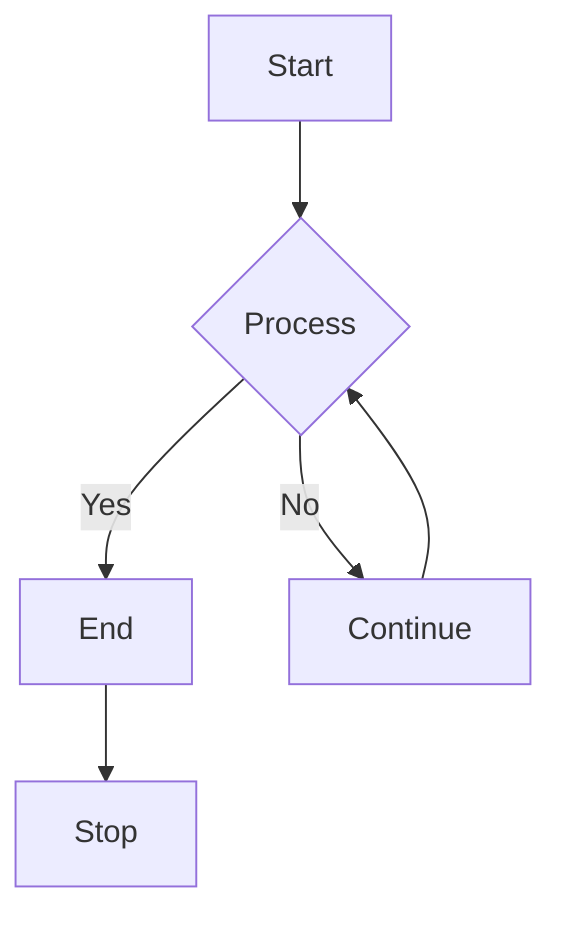

# static-website-on-ec2instance
## 🌐 Hosting a Static Website on AWS EC2 Using NGINX

# 📌 Overview

This guide explains how to host a **static website** (HTML, CSS, JavaScript) on an **AWS EC2 instance** using a web server such as **Apache** or **Nginx**.  
It is suitable for learning purposes, interviews, and small-scale deployments. It reflects a real-world production-like setup commonly discussed in DevOps / Cloud interviews.

# 🧰 Prerequisites

AWS Account

Basic Linux commands

SSH client

Static website files (index.html, style.css, etc.)

# 🏗️ Architecture Overview

User accesses the website via a browser

Request reaches AWS EC2 public IP / DNS

Security Group allows HTTP/HTTPS traffic

NGINX serves static content from /var/www/html

# 📐 Architecture Diagram (Mermaid)



# 🚀 Step-by-Step Implementation

## Step 1: Launch an EC2 Instance

Log in to AWS Management Console

Navigate to EC2 → Launch Instance

Choose an AMI:

Amazon Linux 2 (recommended)

Select instance type:

t2.micro (Free Tier)

Create or select a Key Pair

Configure Security Group:

Allow SSH (22) from your IP

Allow HTTP (80) from Anywhere

## Step 2: Connect to EC2 Instance

```
ssh -i your-key.pem ec2-user@<EC2_PUBLIC_IP>
```

## Step 3: Install Web Server (Apache)

```
sudo yum update -y
sudo yum install httpd -y
sudo systemctl start httpd
sudo systemctl enable httpd
```


